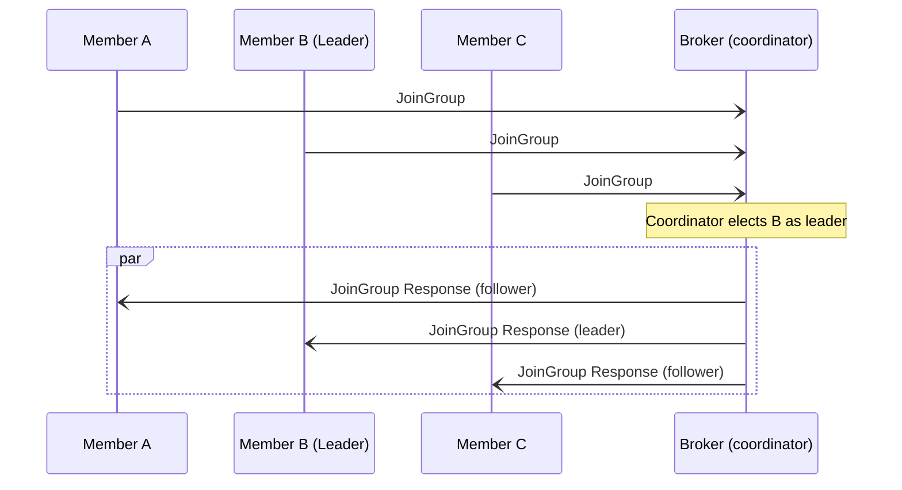
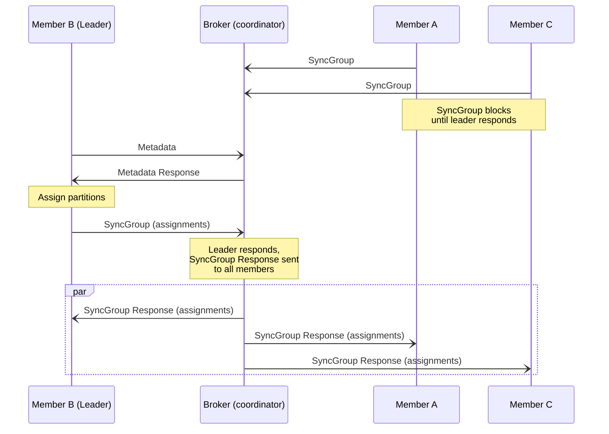

# Client-side (consumer) group rebalancing

Kafine supports client side (consumer) rebalancing, as described [here][kcsap].

[kcsap]: https://cwiki.apache.org/confluence/display/KAFKA/Kafka+Client-side+Assignment+Proposal

Here's a sequence diagram with 3 members.

1. Each of the members sends a `JoinGroup` request to the coordinator, including member metadata (the list of topics it
   would like to consume).
2. The coordinator elects one of the members as the leader. The leader will be responsible for assigning topics and
   partitions to all of the members.
3. The coordinator will send `JoinGroup` responses to all of the members, telling each of them which member is the
   leader. The leader is also given a copy of the metadata from each of the members (the followers get nothing at this point).

The sequence diagram continues below (leader on the left, followers on the right):

4. The followers send an empty `SyncGroup` request to the coordinator, effectively blocking them.
5. The leader examines the metadata for the list of wanted topics, and then issues a `Metadata` request to find out what
   partitions exist for those topics
6. The leader assigns the topics and partitions to the members.
7. The leader sends a `SyncGroup` request to the coordinator, containing the assignments.
8. The coordinator sends a `SyncGroup` response to all of the members, containing their individual assignments.
9. This unblocks the followers (and the leader), and they start fetching from their assigned topics and partitions.

## Other Resources

- <https://www.thestrangeloop.com/2018/the-magical-rebalance-protocol-of-apache-kafka.html>
