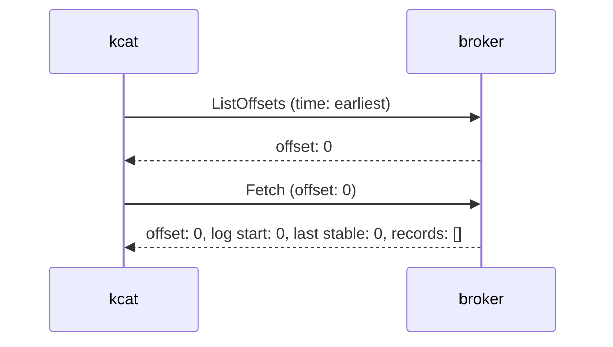
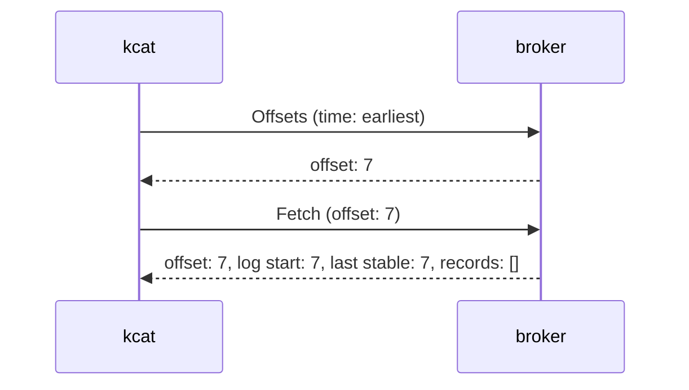
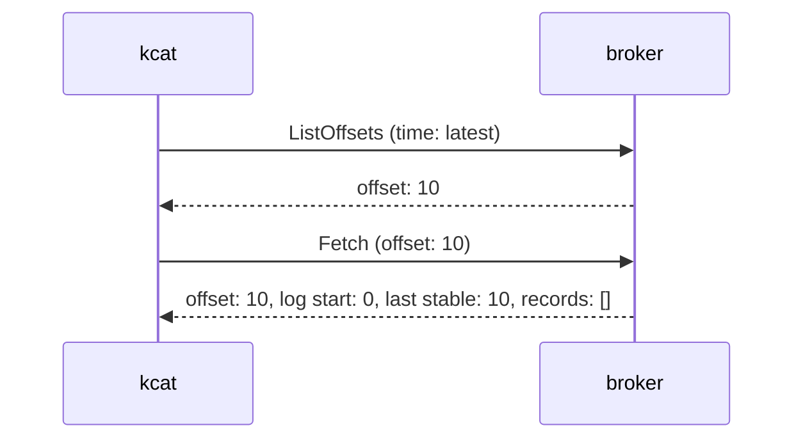
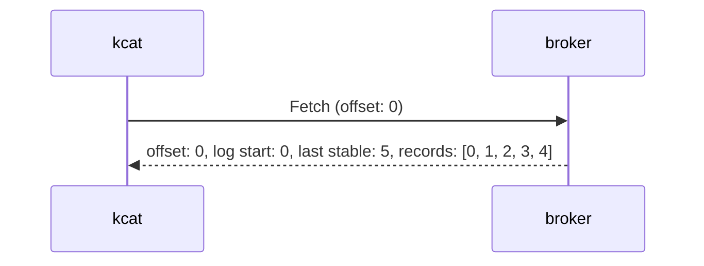
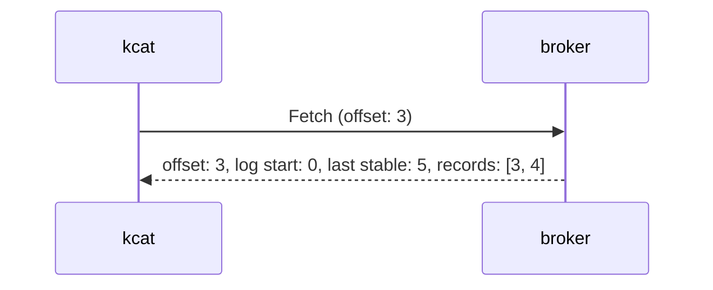
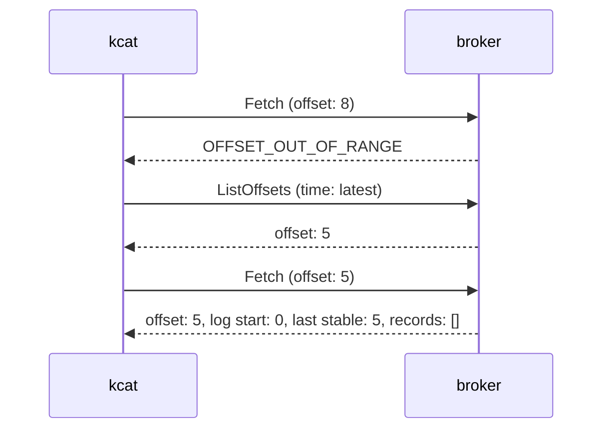
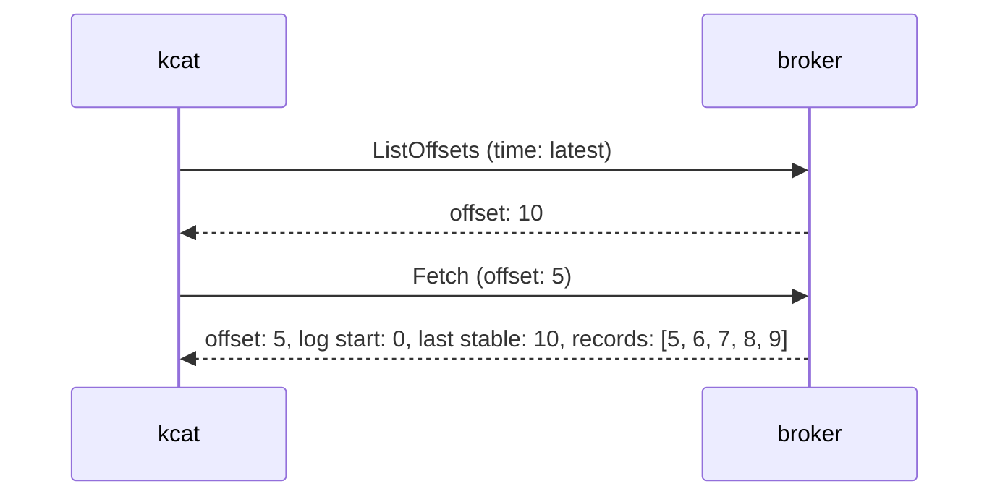
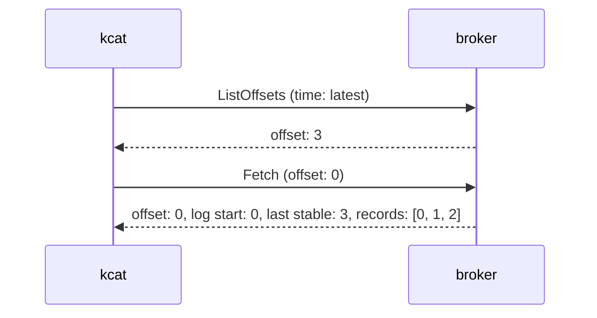
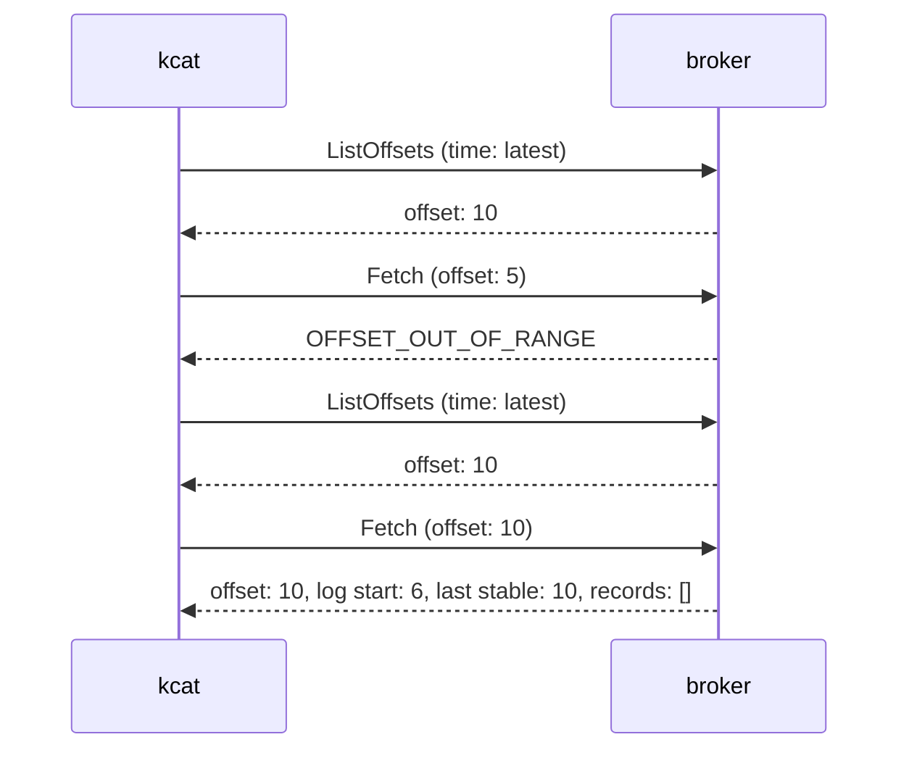

# kcat: offsets

## Background

As of kafine 0.5.1, when you start a simple topic consumer, it will start fetching from offset `-1`, which is invalid.
This will result in a call to the configured `offset_reset_policy` (which defaults to `earliest`). This, in turn,
results in a `ListOffsets` call to the broker to figure out what the earliest available offset for that topic/partition
is.

In comparison, `kcat` immediately issues a `ListOffsets` request to discover the earliest offset.

As an aside: in kcat 1.7.0 (librdkafka 2.6.1), it issues a `ListOffsets` request for each topic/partition, rather than
combining them into a single request per broker.

It would be good if we could do better than both of these approaches. Can we avoid the initial `Fetch` with offset `-1`
-- and the `OFFSET_OUT_OF_RANGE` error result? Can we combine the `ListOffsets` requests into as few requests as
possible?

## What does kcat actually do?

For comparison, let's identify what kcat does in various situations.

You can specify the offset with kcat's `-o` option:

```
Consumer options:
  -o <offset>        Offset to start consuming from:
                     beginning | end | stored |
                     <value>  (absolute offset) |
                     -<value> (relative offset from end)
                     s@<value> (timestamp in ms to start at)
                     e@<value> (timestamp in ms to stop at (not included))
```

For now, we'll ignore the timestamp-based options. The `-o stored` option requires a group ID, so we'll ignore that as
well.

## kamock

Some of the examples below use `kamock`. They assume that you've set it up with the following:

```erlang
{ok, Broker} = kamock_broker:start(make_ref(), #{port => 9292}).

MessageBuilder = fun(_Topic, Partition, Offset) ->
    Key = iolist_to_binary(io_lib:format("key-~B-~B", [Partition, Offset])),
    Value = iolist_to_binary(io_lib:format("value-~B-~B", [Partition, Offset])),
    #{key => Key, value => Value}
end.
```

## -o beginning

The `-o` option defaults to `-o beginning`. That results in an `ListOffsets` request, specifying `time: -2 (earliest)`.



The above shows a newly-created topic, starting at offset zero, with no records.

If the partition doesn't start at offset zero, which is possible if we're using `cleanup.policy=delete`, then the offset will be non-zero:



## -o end

If we start from the end, kcat needs to figure out the end. It does that by sending a `ListOffsets` request, specifying `time: -1 (latest)`:


Again, the above is for a newly-created topic.

For a partition with some records, it looks like this:



## -o VALUE

If you specify a positive (or zero) offset, kcat goes straight into `Fetch`. With `-o 0`:



With `-o 3`:



If that offset doesn't exist, you get an `OFFSET_OUT_OF_RANGE` error and the reset policy kicks in. This partition has 5 messages, so offset 8 doesn't exist:



You get the same behaviour if you specify an offset _before_ the first valid offset -- kcat resets to the latest offset,
by default, which means you miss messages. This is controlled by the `auto.offset.reset` configuration parameter.

## -o -VALUE

If you specify a negative offset, kcat counts backwards from the end of the partition. It does this by issuing a
`ListOffsets` request for `latest` and then subtracting the specified value.

For example, with a topic with 10 messages and `-o 5`:



If the calculated offset would be less than zero, then kcat uses zero (same `-o -5`):



If we're using a compacting topic, and the calculated offset is greater than zero, but before the valid offsets, then
the offset reset policy is used:

```erlang
meck:expect(kamock_list_offsets_partition_response, make_list_offsets_partition_response,
    kamock_list_offsets_partition_response:range(6, 10)).

meck:expect(kamock_partition_data, make_partition_data,
    kamock_partition_data:range(6, 10, MessageBuilder)).
```

```sh
kcat -C -b localhost:9292 -t cars -p 0 -o -5 -e
```


