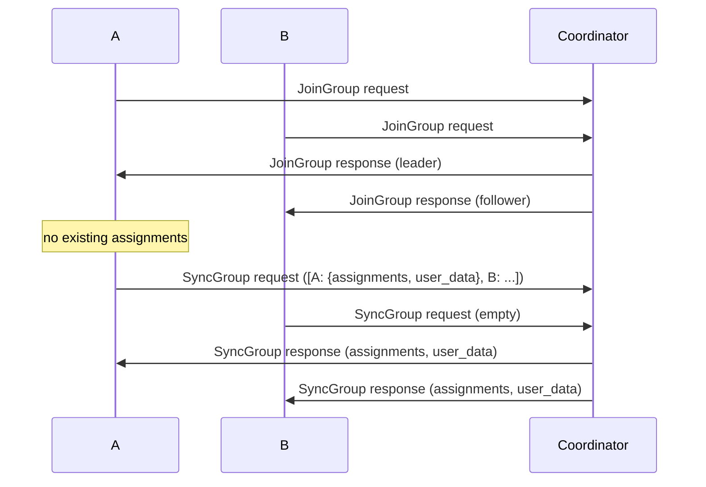
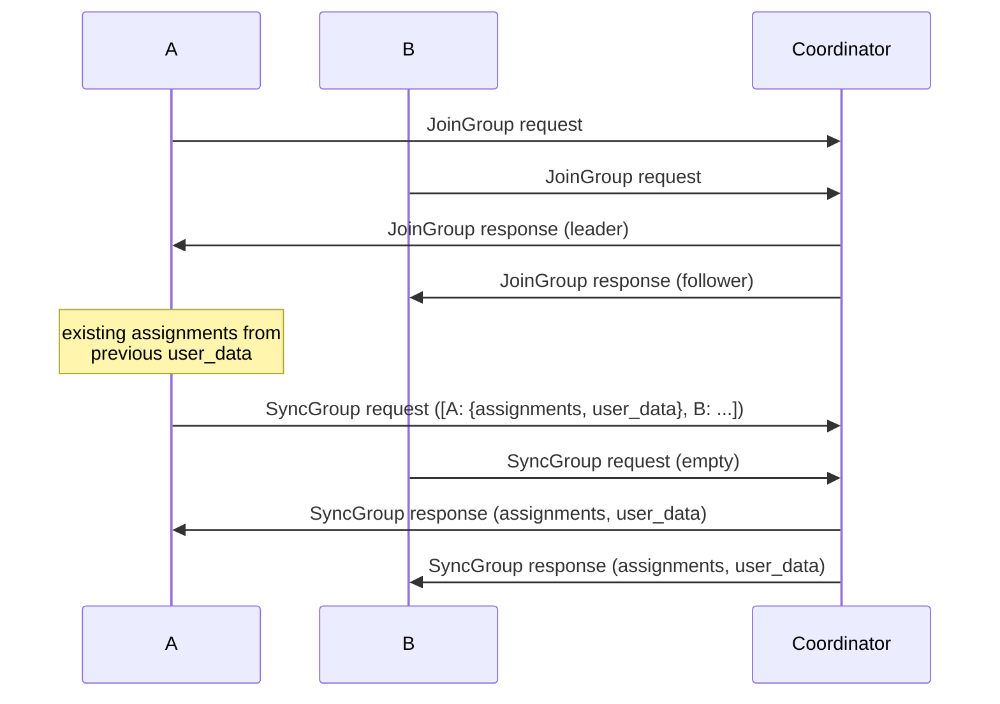

# Sticky Assignments

Ideally, you want to preserve as many existing assignments as possible when a reassignment occurs. This is a "sticky" assignor.

There are a number of different ways to do this. Some examples:

- Java's `StickyAssignor` reports its currently-assigned topics and partitions in the subscription user data, which is
  passed to the leader in `JoinGroup`. The leader can then use this information to ensure that to preserve existing
  assignments as much as possible.
- v2 and later of `ConsumerProtocolSubscription`, sent in `JoinGroup`, can also contain the existing assignments.
- Kafire sends a copy of _all_ of the assignments to all members; see below.

## Kafire

Kafire sends a copy of _all_ of the assignments to all members in the `SyncGroup` user data. This means that the next
leader already has a copy of the previous assignments.

The first rebalance looks like this:

Later rebalances look like this:

